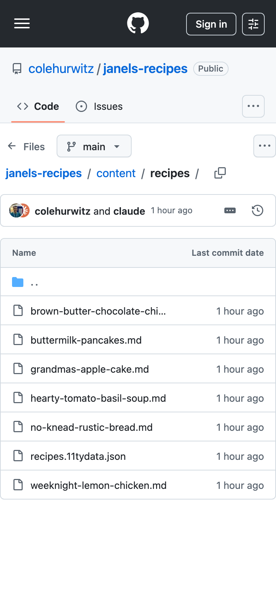
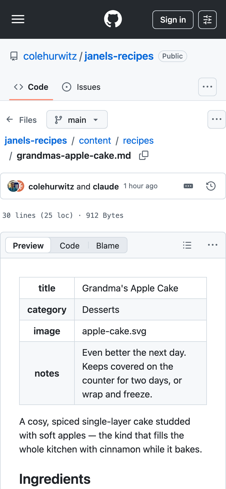
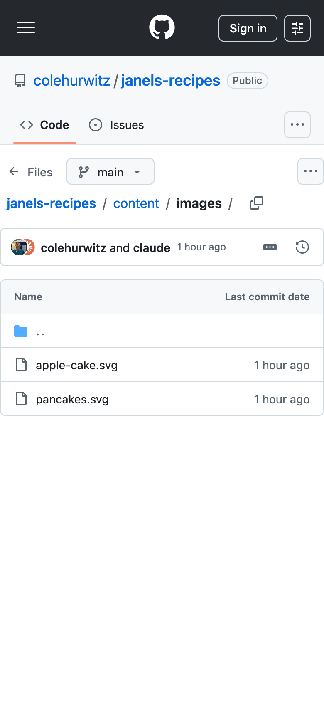
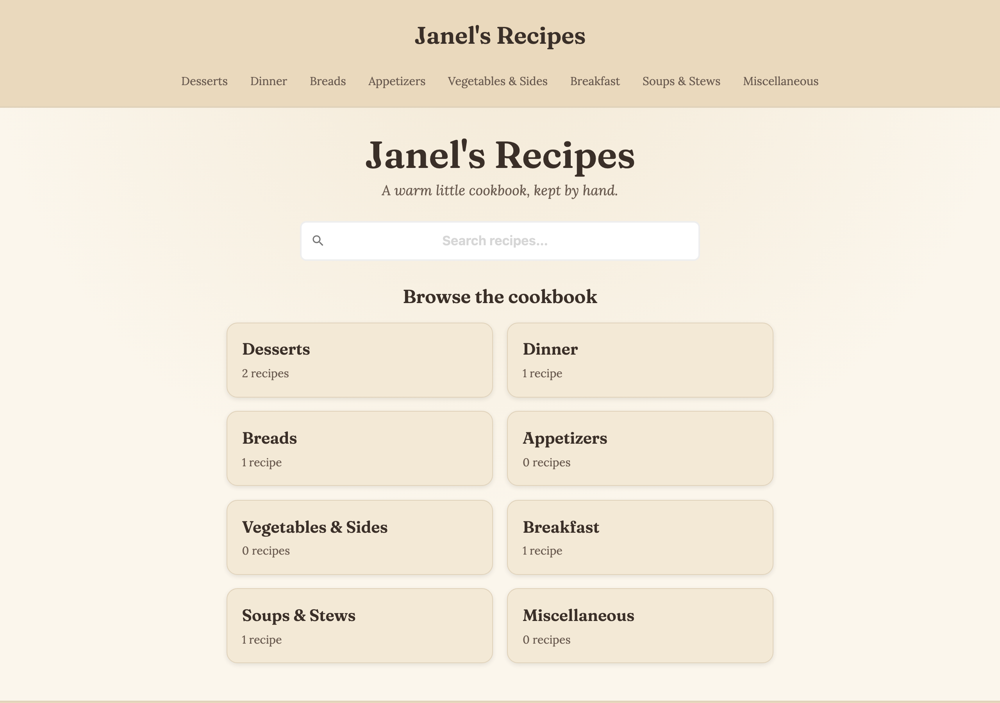
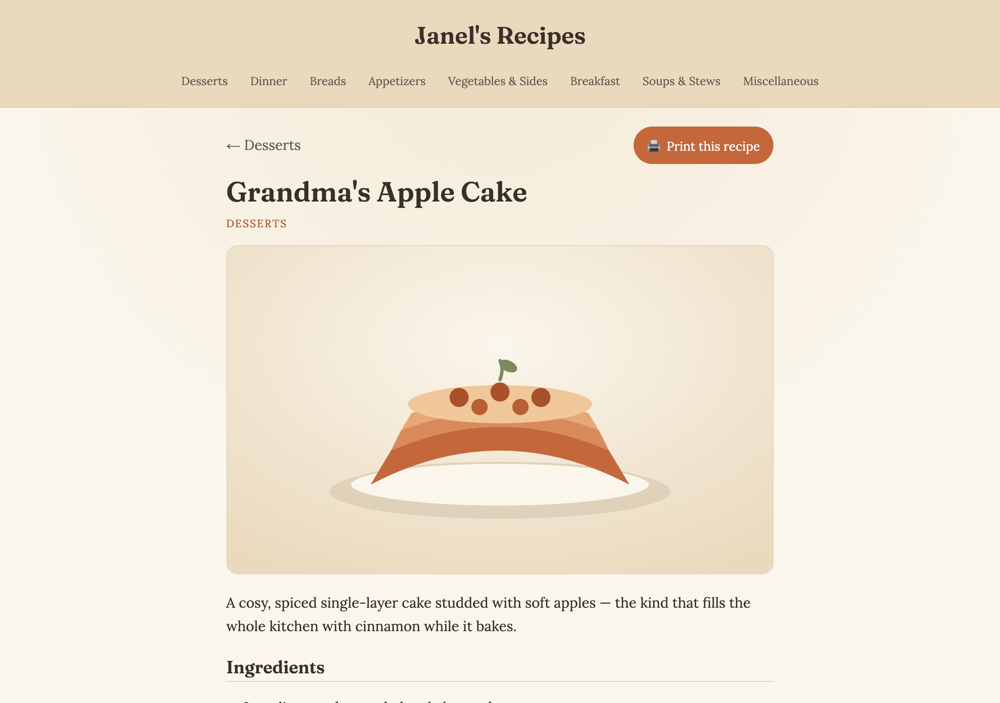

# How to Edit the Cookbook

Hi! This is your friendly guide to changing your recipe website. You do **not**
need to know anything about computers, code, or "GitHub" to use it. Everything
here works right from your **phone** (or a computer if you prefer), just by
**tapping** things in your web browser.

- **Your website (what everyone sees):** https://colehurwitz.github.io/janels-recipes/
- **Where the recipes live (where you make changes):** https://github.com/colehurwitz/janels-recipes

You will sign in to that second link with your GitHub account (the same email and
password you set up). Once you are signed in, you can edit anything.

---

## The one golden habit (please read this first 🙏)

Every time you change something, the website takes a moment to update itself.
After **any** change, do this:

1. **Tap the green "Commit changes" button** to save your change. (You'll see
   this button on every screen — it's how you say "yes, save this.")
2. **Wait about 2 minutes.** ⏱️ The website is rebuilding in the background.
3. **Refresh your website** (https://colehurwitz.github.io/janels-recipes/) and
   check that your change looks right.

If after a few minutes something looks wrong or your change didn't show up, don't
worry — nothing is broken forever. Skip to the **["If something looks wrong"](#if-something-looks-wrong)**
section at the bottom. (Short version: there's a tab called **"Actions"** that
shows whether the update worked, and a **"Run workflow"** button that re-tries it.)

That's the whole secret: **change → Commit → wait 2 minutes → refresh.**

---

## A few words you'll see a lot

- **The pencil icon ✏️** — this little drawing of a pencil means "let me change
  this." You tap it whenever you want to edit text.
- **Commit changes** — a fancy word for **"Save."** Tapping the green
  "Commit changes" button saves your work and starts the website updating.
- **A `.md` file** — each recipe is one little text file whose name ends in
  `.md`. One recipe = one file. That's it.
- **Frontmatter** — the few lines at the very top of a recipe, between two lines
  that each say `---`. It holds the recipe's **title**, its **category**, and
  optionally an **image** and **notes**. Keep the two `---` lines exactly as they
  are and you'll be fine.

---

## Task A — Edit a recipe

Use this when you want to fix a typo, change an ingredient, or reword the steps
of a recipe that's already on the site.

1. **Open the recipes folder.** Go to
   https://github.com/colehurwitz/janels-recipes and tap the folder called
   **`content`**, then the folder called **`recipes`**. You'll see a long list of
   files — one for each recipe, like `apple-pie.md`.

   

2. **Tap the recipe you want.** For example, tap **`grandmas-apple-cake.md`**.
   (Tip: there's a search box at the top of the file list if you have trouble
   finding it.) This shows you the recipe as it is now.

   

3. **Tap the pencil icon ✏️.** It's near the top-right of the recipe. This lets
   you start changing the text.

   *(screenshot: run docs/capture-screenshots.mjs after a one-time sign-in — see docs/SCREENSHOTS.md)*

4. **Change the text.** You'll see the recipe as editable text. Two parts:
   - The **frontmatter** at the very top (between the `---` lines): you can change
     the **title**, the **category** (must be one of the 8 categories — see the
     list at the bottom), the **notes**, or the **image** file name.
   - The **recipe itself** below it: the ingredients and the steps. Just tap where
     you want and type.

   Keep the two `---` lines exactly as they are. Everything between them is the
   frontmatter; everything below the second `---` is the recipe.

   *(screenshot: run docs/capture-screenshots.mjs after a one-time sign-in — see docs/SCREENSHOTS.md)*

5. **Save it.** Tap **"Commit changes"** (top-right), then tap the green
   **"Commit changes"** button to confirm. You can ignore the little description
   box — it's optional.

   *(screenshot: run docs/capture-screenshots.mjs after a one-time sign-in — see docs/SCREENSHOTS.md)*

6. **Remember the golden habit:** wait ~2 minutes, then refresh your website to
   see the change. ✅

---

## Task B — Add a new recipe

A new recipe is just **one new file**. The easiest way is to copy the words from
a recipe you already have, then make a fresh file and paste them in. You only ever
create **that one file** — you never touch anything else, and the recipe will
**automatically** show up on its category page and in the search box. ✨

**First, copy an existing recipe's text:**

1. Open any recipe (Task A, steps 1–2), tap the **pencil ✏️**, then tap inside the
   text, **Select all**, and **Copy**. (On a phone: tap and hold in the text, tap
   "Select All," then "Copy.") This gives you a ready-made template to paste.

   *(screenshot: run docs/capture-screenshots.mjs after a one-time sign-in — see docs/SCREENSHOTS.md)*

**Now make the new file:**

2. Go back to the **`content` → `recipes`** folder. Tap the **"Add file"** button
   near the top-right, then tap **"Create new file."**

   *(screenshot: run docs/capture-screenshots.mjs after a one-time sign-in — see docs/SCREENSHOTS.md)*

3. **Name the file.** In the name box, type a short name ending in `.md`, for
   example **`my-new-recipe.md`**.

   > 💡 **Important:** the file name becomes the recipe's web address, so use
   > **all lowercase with hyphens** instead of spaces — like
   > `lemon-bars.md` or `grandmas-chili.md`. No capital letters, no spaces.

   *(screenshot: run docs/capture-screenshots.mjs after a one-time sign-in — see docs/SCREENSHOTS.md)*

4. **Paste and edit.** Tap in the big text area and **Paste** the recipe you
   copied. Then change:
   - the **title** (the real name of your recipe),
   - the **category** (one of the 8 — see the list at the bottom),
   - the ingredients and steps below the `---` lines.

   Leave the two `---` lines in place.

5. **Save it.** Tap **"Commit changes"**, then the green **"Commit changes"**
   button to confirm.

6. **Golden habit:** wait ~2 minutes, refresh your website. Your new recipe
   appears on its category page and is searchable — no other steps needed. 🎉

---

## Task C — Add a photo to a recipe

Adding a picture is **two small steps**: first you put the photo into the website,
then you tell the recipe to use it.

### Step 1 — Upload the photo

1. Go to the **`content`** folder, then tap the **`images`** folder.

   

2. Tap **"Add file"** (top-right), then tap **"Upload files."**

   *(screenshot: run docs/capture-screenshots.mjs after a one-time sign-in — see docs/SCREENSHOTS.md)*

3. **Choose your photo.**
   - On a **computer**, you can drag the photo from your desktop into the box.
   - On a **phone**, tap the **"choose your files"** link in the box and pick the
     photo from your camera roll. (Phones don't drag-and-drop — you tap to choose.)

   Give the photo a simple lowercase name if you can, like `apple-cake.jpg`.
   **Remember the exact file name** — you'll need it in Step 2.

4. Tap the green **"Commit changes"** button to save the photo.

### Step 2 — Tell the recipe to show the photo

5. Open the recipe you want the photo on (Task A, steps 1–3) and tap the
   **pencil ✏️**.

6. In the **frontmatter** at the top, find the line that starts with `image:` and
   put your photo's file name after it, in quotes. For example:

   ```
   image: "apple-cake.jpg"
   ```

   (If the line currently says `image: ""`, just type your file name between the
   quotes.)

7. Tap **"Commit changes"**, then the green button to confirm.

8. **Golden habit:** wait ~2 minutes, refresh the recipe page on your website —
   the photo should now appear at the top. 📷

> If the photo doesn't show up, double-check that the file name in the recipe
> **exactly matches** the file you uploaded (including the `.jpg` part and the
> spelling — capitals matter here).

---

## Seeing your changes on the live site

After you wait the ~2 minutes, here's roughly what your site looks like. The
homepage with the categories and the search box:



And an individual recipe page (this is where your edits and photos show up):



---

## If something looks wrong

Don't panic — your recipes are safe, and nothing you do here can break things
permanently. A small mistake (like accidentally deleting one of the `---` lines)
can sometimes stop the website from updating. Here's how to fix it:

1. **First, just wait a little longer.** Updates usually take about 2 minutes but
   can occasionally take 5. Refresh the page once more before worrying.

2. **Fix the recipe and save again.** Most problems come from a small typo in a
   recipe. Open the recipe you just changed, look at the top — make sure there are
   still **two `---` lines** with the title and category between them — fix
   anything that looks off, and tap **"Commit changes"** again. That alone fixes
   almost everything.

3. **Check the "Actions" tab.** On the repo page
   (https://github.com/colehurwitz/janels-recipes), there's a tab at the top
   called **"Actions."** Tap it. Each time you save, a new line appears here:
   - a **green check ✅** means the update worked,
   - a **red X ❌** means something stopped it (usually the typo from step 2).

4. **Use the "Run workflow" safety net.** If you've fixed the recipe but the site
   still seems stuck, go to the **"Actions"** tab, tap the workflow on the left
   (called **"Deploy to GitHub Pages"** or similar), then tap the **"Run workflow"**
   button on the right. This simply asks the website to rebuild itself again. It's
   safe to tap anytime.

When in doubt: keep the `---` lines, fix the recipe, commit again, wait, refresh.
You really can't hurt anything. 💛

---

## The 8 categories

Every recipe's `category:` must be **exactly** one of these (spelling and capital
letters matter):

- `Desserts`
- `Dinner`
- `Breads`
- `Appetizers`
- `Vegetables & Sides`
- `Breakfast`
- `Soups & Stews`
- `Miscellaneous`

---

*Some of the pictures in this guide show buttons that only appear once you're
signed in. To fill those in, see [`docs/SCREENSHOTS.md`](docs/SCREENSHOTS.md) —
it's a one-time setup that whoever set up the site can do for you.*
